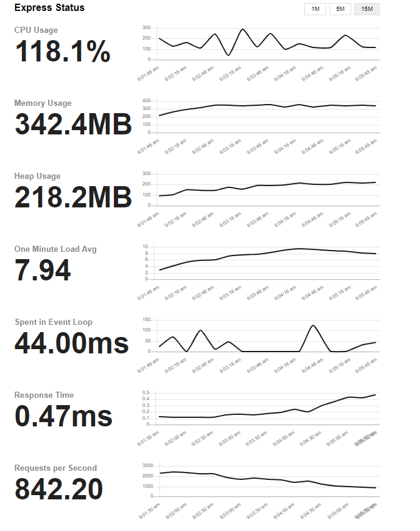

# winston-http-oom

A demo to reproduce winston OOM with http transport.

## How to run?

1. Start log server to receive logs

_Log server use nodejs 20 since nodejs 20 is up to 96.13% faster than Node.js 18 when handling HTTP requests._

```
cd log-server
nvm use
npm install
npm start
```

2. Start client with winton http transport to send logs


```
cd winston-http-oom-client
nvm use
npm install
npm run inspect
```

3. Run stress tests by using [artillery](https://github.com/artilleryio/artillery)

_To make OOM happens more quickly, vusers is set to `3000` and `--max-old-space-size=256`._

```
cd winston-http-oom-client
npm run stress-test
```

## What happens when running stress test?

1. Heap increaed a lot.



2. Client will be creash caused by OOM.
```
FATAL ERROR: Ineffective mark-compacts near heap limit Allocation failed - JavaScript heap out of memory
 1: 0xb9a330 node::Abort() [node]
 2: 0xaa07ee  [node]
 3: 0xd71ed0 v8::Utils::ReportOOMFailure(v8::internal::Isolate*, char const*, bool) [node]
 4: 0xd72277 v8::internal::V8::FatalProcessOutOfMemory(v8::internal::Isolate*, char const*, bool) [node]
 5: 0xf4f635  [node]
 6: 0xf50538 v8::internal::Heap::RecomputeLimits(v8::internal::GarbageCollector) [node]
 7: 0xf60a33  [node]
 8: 0xf618a8 v8::internal::Heap::CollectGarbage(v8::internal::AllocationSpace, v8::internal::GarbageCollectionReason, v8::GCCallbackFlags) [node]
 9: 0xf64a75 v8::internal::Heap::HandleGCRequest() [node]
10: 0xee2bdf v8::internal::StackGuard::HandleInterrupts() [node]
11: 0x12e349f v8::internal::Runtime_StackGuardWithGap(int, unsigned long*, v8::internal::Isolate*) [node]
12: 0x1710739  [node]
Aborted (core dumped)
```

**P.S There is a pure express client could be used for testing express without winston.**